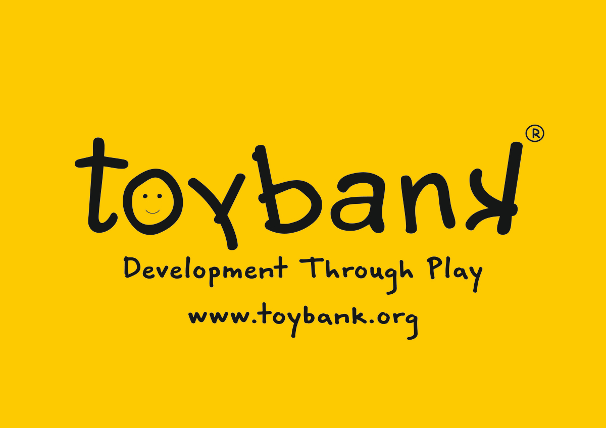

# Code to Give Hackathon - Morgan Stanley
---

Morgan Stanley’s Code to Give is a virtual hackathon that brings technologists and nonprofits together to solve real-world problems using technology.

Through Code to Give, we worked in teams to develop technical prototypes for one of Morgan Stanley's India-based nonprofit partners: The Opentree Foundation (Toybank). 

## Team Members
---
- [Uzma Firoz Khan](https://github.com/uzma024)
- [Wadiya Ali](https://github.com/Wadiya003)
- [Pooja Gulhane](https://github.com/poojagulhane)
- [Shraddha Pawar]()
- [Rutuja Walvekar]()
- [Neha Patil]()

## Mentors
---
- [Sangeeta Das]()
- [Zishan Z Syed]()

## Challenge Statement

---

Driven by the ethos that it’s easier to build strong children than to repair broken men and women, since 2004, The Opentree Foundation’s flagship project 'Toybank — Development through Play' has been providing safe play and learning spaces to at-risk children to keep them on-track with their mental and behavioral well-being.

With a presence in 12 districts across Maharashtra, Toybank impacts 60,000+ children through 634 Support Groups, which were set up digitally in response to Covid-19. Pre-pandemic, the support to the children was through 420+ physical Play2Learn centres. Their vision is for a world where children feel safe, feel wanted and cared for, and are able to holistically grow to become well-rounded, responsible adults who are able to make positive life choices.

### Technical challenge: 
Build a volunteer mapping system, which will aid Toybank in mapping volunteers to activities and the relevant Play2Learn centres (a.k.a Play Rooms / Play Centers), in addition to streamlining the process of scheduling their visits and support activities.

## Tech-Stack Used
> - HTML, CSS, Bootstrap, JavaScript
> - Nodejs , express, ejs , user authentication
> - MySQL database
